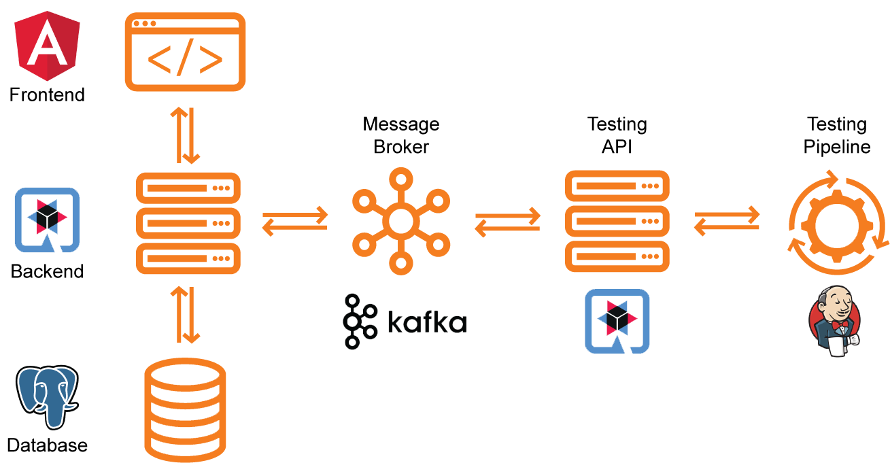
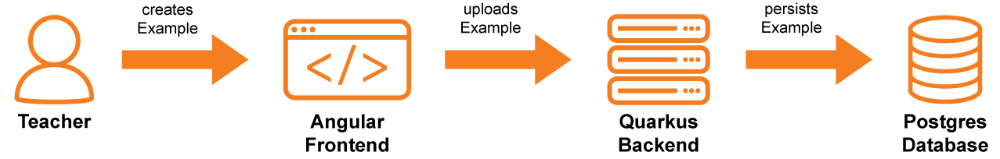
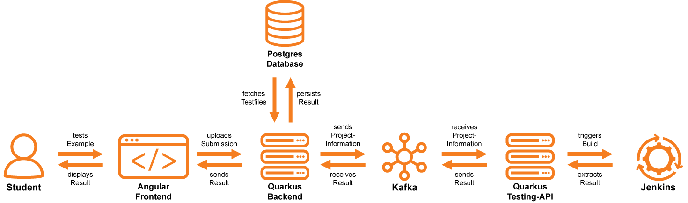

= LeoCode
Christian Donnabauer
:revealjs_theme: serif
:customcss: ./custom.css

[id="logo1"]

== Team

== Was ist LeoCode?
[id="logo2"]

=== Ausgangssituation

* verwirrendes Setup zum Programmieren
* schwierige Testvorbereitung
* fehlendes Feedback
* Lernaufwand wird nicht benotet
* langsames Einarbeiten neuer Lehrkräfte

[.notes]
--
* Einstieg in die Programmierung oft verwirrend, Setup
* unerfahrene Schüler, zum Lernen von Beispielen nur Beispiele aus dem Unterricht
wiederholen => auswendig Lernen als Lernen zu Coden
* wenn sie eigene beispiele machen => fehlende Überprüfung
* Neue Lehrer kennen Niveau nicht => Schüler überforder/unterfordert,
ungleichmäßiges Leistungsniveau an der Schule
* Lehrer können nur bedingt Lernaufwand benoten
--

=== Abhilfe mit LeoCode

* Online Editor
* von Lehrern erstellte Beispiele
* am Server getesteter Code
* Schülerportfolio

[.notes]
--
* Durch einen Editor welchen LeoCode hosted können Anfänger ohne etwas zu installieren direkt im Browser programmieren
* Um an mehr Übungsmaterial zu kommen können Schüler von Lehrern erstellte Beispiele (inklusive Angabe & Tests)
ausprobiern
* Hat ein Schüler ein Beispiel programmiert kann dieser die Code Files einsenden, die Files werden nach Funktionalität
(Unittest von Lehrern) und spezielle Umsetzungen (ist String Builder verwendet worden) getestet
* Programmiert ein Schüler ein Beispiel wird das jeweilige Beispiel und dessen Ergebnis einem Schülerportfolio
zugeordnet
--

== Umsetzung
[id="logo3"]

=== Systemarchitektur

[id="sysarch"]

=== Ablauf

[id="logo6"]

=== Lehrer erstellt ein Beispiel

=== Schüler testet seinen Code

[id="studentSequence"]

== Projektstatus
[id="logo4"]

=== Fertig Implementiert

* Provisorisches Angular Frontend
* Kommunikation via Kafka
* Backend Server
* Testing-Api

=== In Arbeit

* Blacklist
* Whitelist

=== Ausblick in die Zukunft

* Unterstützung mehrerer Programmiersprachen
* Online Editor (Theia)
* Docker in Docker

== Noch Fragen?
[id="logo5"]

== Vielen Dank für Ihre Aufmerksamkeit!
